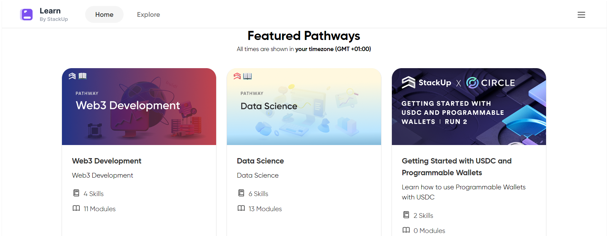
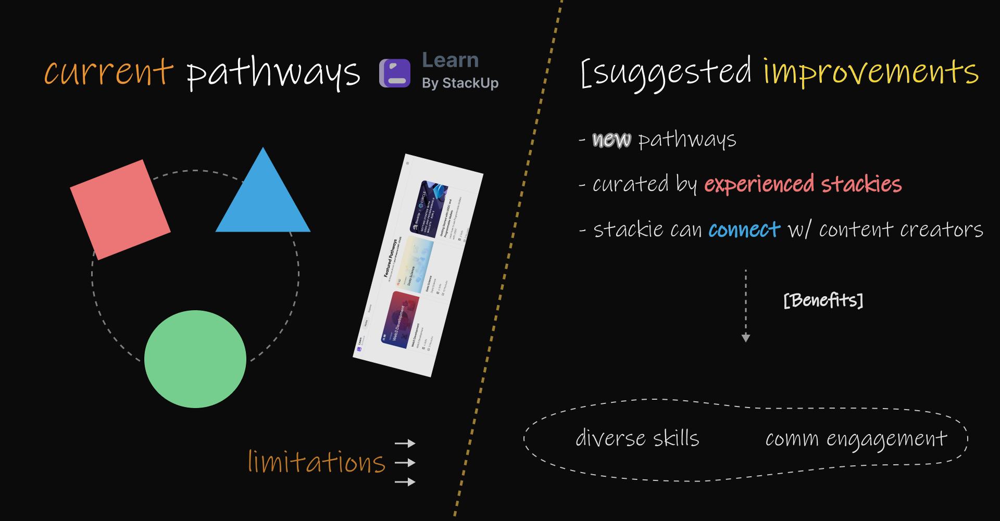
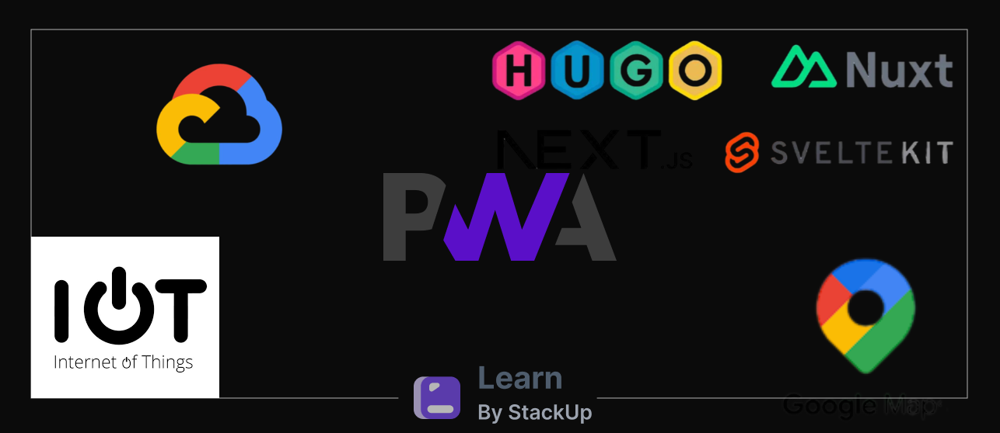

# Ideation-for-stackupcommunity-2024-

I have been a member of the **Stackup community** for close to two years now, and it is impressive how much I have learned during that period. The Stackup platform provides insights and knowledge ranging from basic to advanced levels in several fields of interest. However, sometimes we also require comprehensive knowledge about a topic.

As a stackie, I have had to build upon some practical knowledge learned through my Stackup experience or look elsewhere for it. It has also occurred to me on several occasions that some stackies have a lot they can share with the rest of the community.

The **Learning Pathways** in Stackup (Learn) have always fascinated me, and I check them regularly. But what do I do when they don’t contain pathways on a diverse set of topics I'm interested in?

I’d like to suggest an improvement for this: Could the advanced knowledge, experience, and skillset developed by stackies also be **incorporated into this hub**?

Not just from the Stackup Team, but if Stackup can allow curated content to be developed into new pathways by experienced stackies, it will not only provide a new set of learning topics but also diverse skills for the rest of the community. Furthermore, having the ability to reach out personally to the content creator could pique stackies' interest and foster more meaningful relationships.

Stackup is a place to share practical knowledge and grow our developer experience, and this ideation can accelerate this growth.

#### Let me give a quick narrative to support this:

I have always wished for **design-related quests and bounties** to be released on Stackup (Earn) as a way for me to gain new insights into tools and techniques. However, I have come to understand that Stackup is more focused on code development. There have been a couple of design-related interests and questions from other stackies, and while I have some experience in this field, I haven’t taken the opportunity to share my insights with others.

Consider other intricate development topics that stackies are interested in, such as **static sites**, **progressive apps**, **Google Maps**, **no-code platforms**, **AI workflows**, **IoT development**, and **cloud platforms**.

#### You (stackie) can learn these by yourself, but it helps to learn from people who have gone before you!

## Ideation by Chel
### - Stackie 2024
